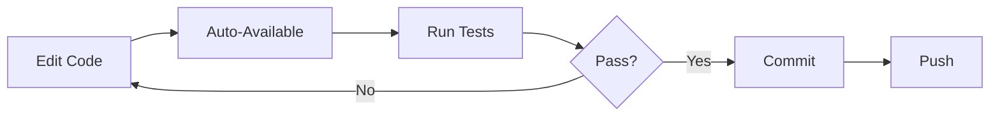

# Architecture Overview

Understanding how provide-workspace orchestrates the provide.io ecosystem for development.

## Meta-Repository Pattern

provide-workspace uses a **meta-repository pattern** - coordinating multiple independent repositories rather than using a traditional monorepo.

### Key Concepts

**Independent Repositories**
:   Each package maintains its own git repository with independent history, issues, and releases.

**Workspace Coordination**
:   provide-workspace coordinates these repositories, providing unified development environment and tooling.

**Editable Installs**
:   All packages installed in editable mode (`uv pip install -e`), making changes immediately available across the workspace.

**Shared Virtual Environment**
:   Single `.venv` at workspace root contains all packages, enabling cross-package development.

See [Meta-Repository Pattern](meta-repository/) for detailed comparison with alternatives.

## Why Meta-Repository?

### Advantages

**Independent Releases**
:   Each package versions and releases independently.

**Clear Ownership**
:   Each repository has clear boundaries and issue tracking.

**Flexible Development**
:   Work with all packages or just a subset.

**Standard Git Workflows**
:   PRs, branches, and commits work like any single-repository project.

**Per-Package CI/CD**
:   Each package has its own optimized CI/CD pipeline.

### Trade-offs

**Coordination Needed**
:   Changes spanning multiple packages require multiple PRs.

**Version Management**
:   Must manage inter-package dependencies and compatibility.

**Initial Setup Time**
:   Longer clone time (13+ repositories) but automated with bootstrap script.

## Package Organization

The ecosystem uses a three-layer architecture. For detailed information about what each package does, see the [Foundry Architecture](https://foundry.provide.io/foundry/architecture/).

**From a workspace perspective**, the layers determine installation order and development workflow:

```
┌─────────────────────────────────────┐
│         Tools Layer                 │
│  Can depend on Framework+Foundation │
└──────────────┬──────────────────────┘
               │
┌──────────────▼──────────────────────┐
│      Framework Layer                │
│  Depends on Foundation              │
└──────────────┬──────────────────────┘
               │
┌──────────────▼──────────────────────┐
│       Foundation Layer              │
│  Minimal external dependencies      │
└─────────────────────────────────────┘
```

Installation flows bottom-up (Foundation → Framework → Tools). Changes propagate top-down (Foundation changes affect all layers).

See [Package Layers](layers/) for dependency details and [wrknv Integration](wrknv-integration/) for how workspace configuration works.

## Workspace Structure

```
provide-workspace/
├── .venv/                  # Shared virtual environment
├── scripts/
│   ├── bootstrap.sh        # Clone repositories
│   ├── setup.sh            # Install dependencies
│   └── validate.sh         # Verify environment
├── tests/                  # Workspace tests
│   ├── unit/
│   └── integration/
├── wrknv.toml              # Workspace configuration
├── pyproject.toml          # Workspace metadata
├── docs/                   # Workspace documentation
└── README.md

../                         # Sibling directories
├── provide-foundation/     # Foundation packages
├── provide-testkit/
├── pyvider/                # Framework packages
├── pyvider-cty/
├── pyvider-hcl/
├── pyvider-rpcplugin/
├── pyvider-components/
├── flavorpack/             # Tools packages
├── wrknv/
├── plating/
├── tofusoup/
├── supsrc/
└── provide-foundry/        # Documentation hub
```

## Development Workflow



### Editable Install Flow

1. **Developer edits** `provide-foundation/src/provide/foundation/logger.py`
2. **Immediately available** in all packages that import it (no reinstall needed)
3. **Test in pyvider** without any build/install step
4. **Commit in provide-foundation** repository
5. **Update version** when ready for release

See [Development Workflow](../guide/workflow/) for practical examples.

## Configuration Management

### wrknv.toml

Defines workspace structure:

```toml
[workspace]
name = "provide-workspace"
description = "provide.io ecosystem workspace"

[[siblings]]
name = "provide-foundation"
path = "../provide-foundation"

[[siblings]]
name = "provide-testkit"
path = "../provide-testkit"

# ... more siblings
```

See [Configuration](../reference/configuration/) for complete reference.

### Package Dependencies

Each package defines its own dependencies in `pyproject.toml`:

```toml
[project]
dependencies = [
    "provide-foundation>=0.1.0",
]
```

The workspace setup script installs all packages respecting these dependencies.

## Design Principles

### 1. Independence

Each package can stand alone:
- Has its own tests
- Has its own documentation
- Can be installed independently
- Can be released independently

### 2. Coordination

The workspace provides:
- Unified setup process
- Shared virtual environment
- Cross-package testing
- Integrated documentation

### 3. Flexibility

Developers can:
- Work with full workspace
- Clone only needed packages
- Use symbolic links for existing clones
- Mix workspace and individual workflows

### 4. Simplicity

- Three scripts: bootstrap, setup, validate
- Standard Python packaging (no custom tools required)
- Works with standard Git workflows
- Compatible with all Python tooling

## Comparison with Alternatives

### vs. Monorepo

| Feature | provide-workspace | Monorepo |
|---------|-----------------|----------|
| Repository | Multiple | Single |
| Git History | Independent | Shared |
| Releases | Per-package | Usually all together |
| Cloning | ~30 seconds per repo | One clone (can be huge) |
| CI/CD | Per-package | Whole repo |
| Tooling | Standard Git | Often custom (Bazel, etc.) |

### vs. Individual Clones

| Feature | provide-workspace | Manual Individual |
|---------|-----------------|-------------------|
| Setup Time | 3 commands | 13+ clone + setup commands |
| Cross-Package Dev | Seamless | Manual linking required |
| Consistency | Enforced by scripts | Manual |
| Documentation | Integrated | Fragmented |
| Testing | Workspace-level + per-package | Only per-package |

## Implementation Details

### Bootstrap Process

See [bootstrap.sh reference](../reference/bootstrap/)

### Setup Process

See [setup.sh reference](../reference/setup/)

### Validation Process

See [validate.sh reference](../reference/validate/)

## Next Steps

- **[Meta-Repository Pattern](meta-repository/)** - Deep dive into the pattern
- **[Package Layers](layers/)** - Detailed dependency relationships
- **[Workspace vs Workenv](workspace-vs-workenv/)** - Understanding environments
- **[wrknv Integration](wrknv-integration/)** - How wrknv enables the workspace
